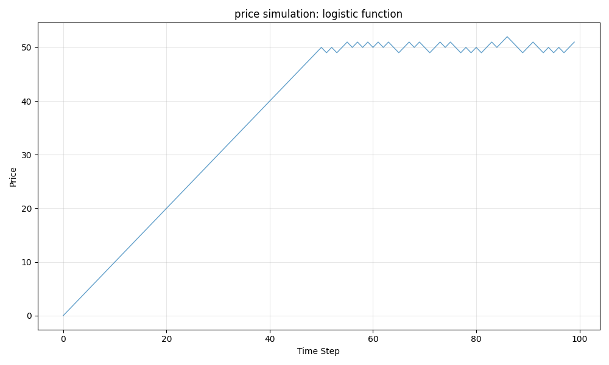
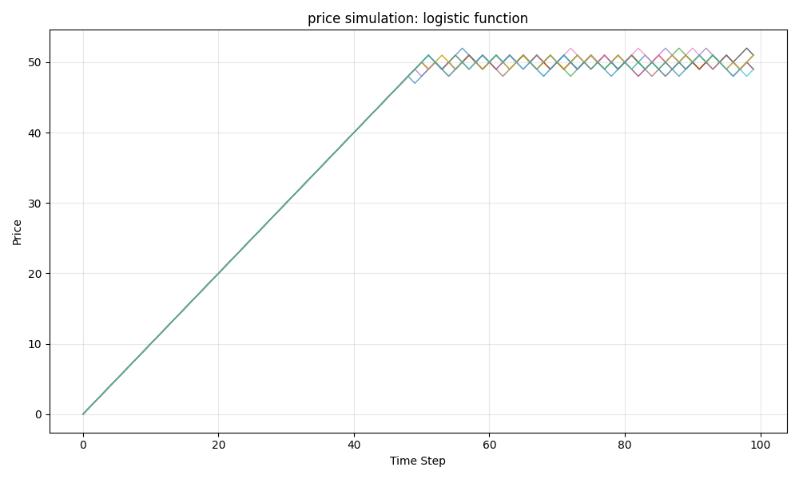

# Objective

The objective is to understand the _reinforcement learning_ or RL by implementing the codes of the RL book. 

# RL book

The RL book itself is available here:

https://stanford.edu/~ashlearn/RLForFinanceBook/book.pdf

https://cme241.github.io/#learning-material

# Code

Code for this section of the RL book is implemented:

> 3.2. Understanding Markov Property from Stock Price Examples

Our code is available here:

https://github.com/k4sh4n1/research/tree/master/book_RL_Stanford/001

# Markov process: logistic function

The code results are presented here.

