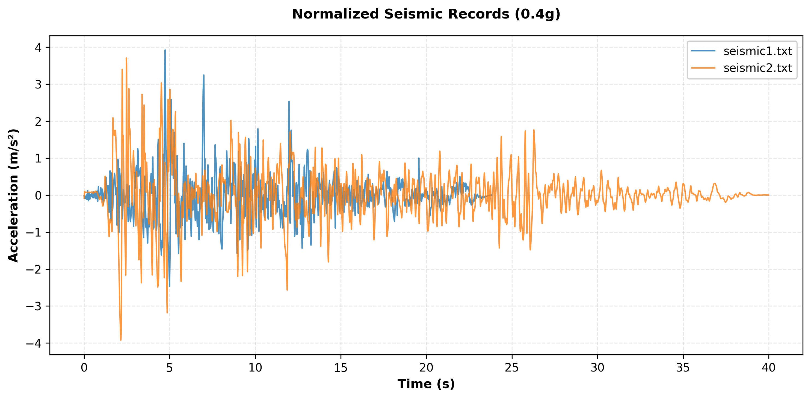
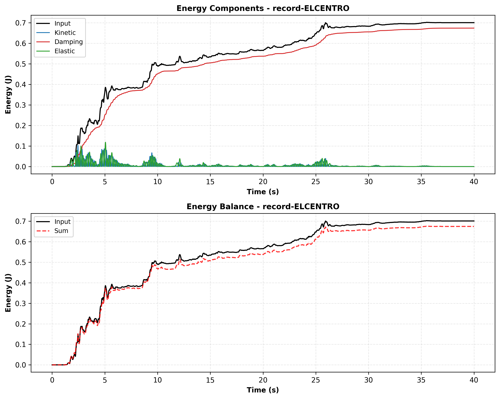
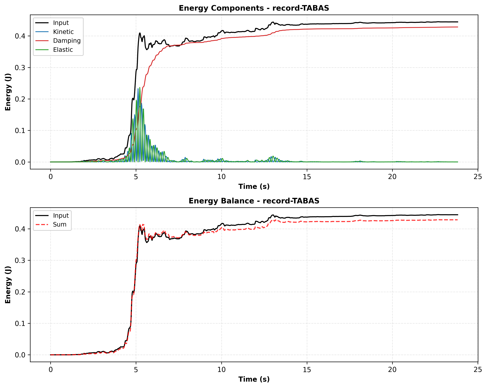
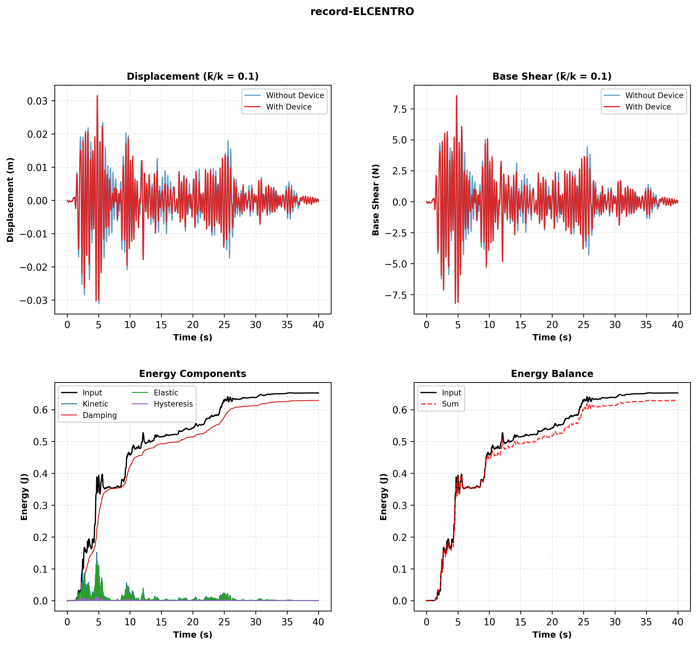
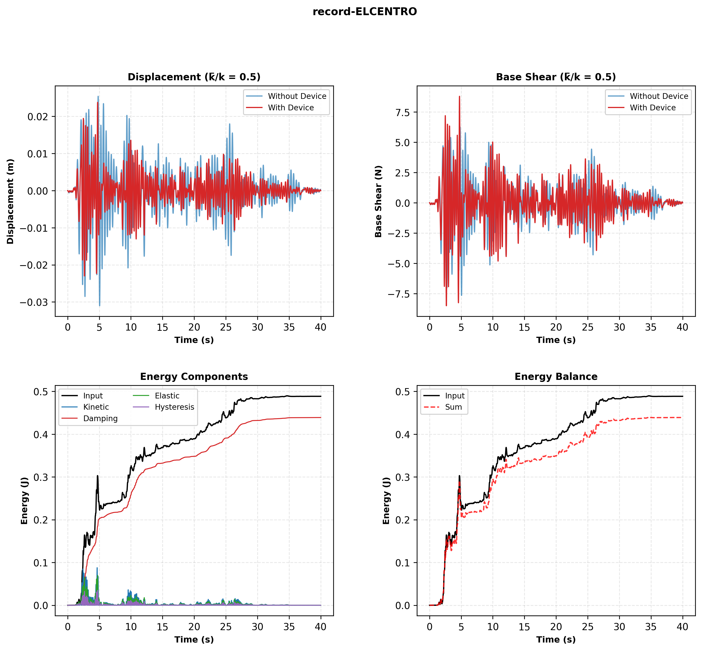
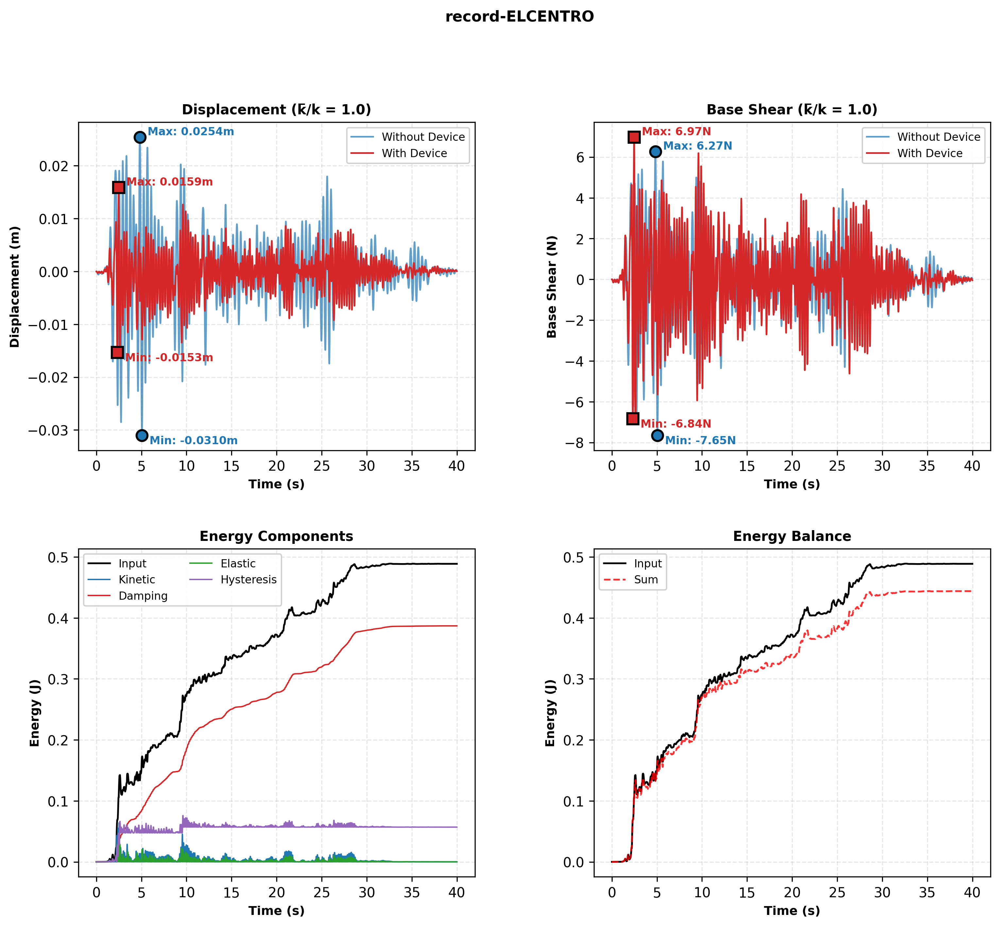
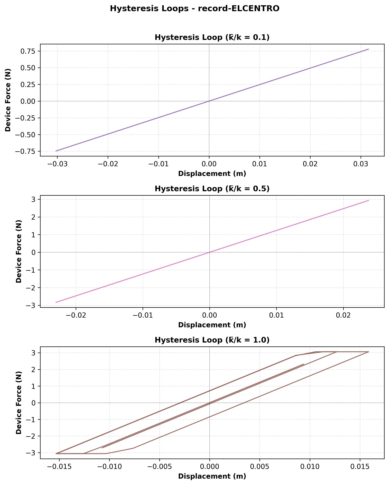
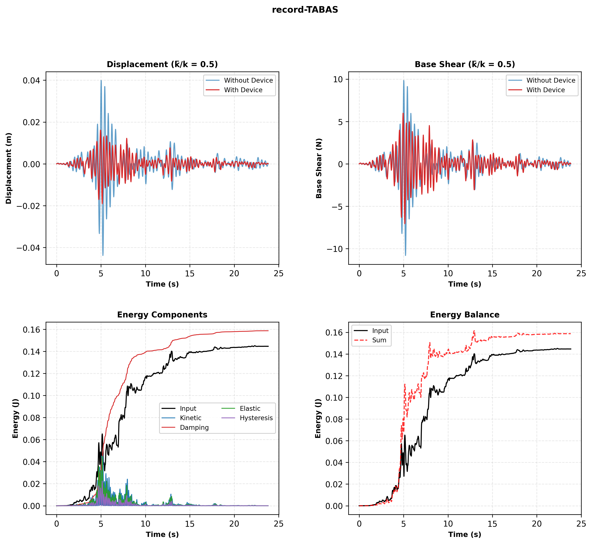
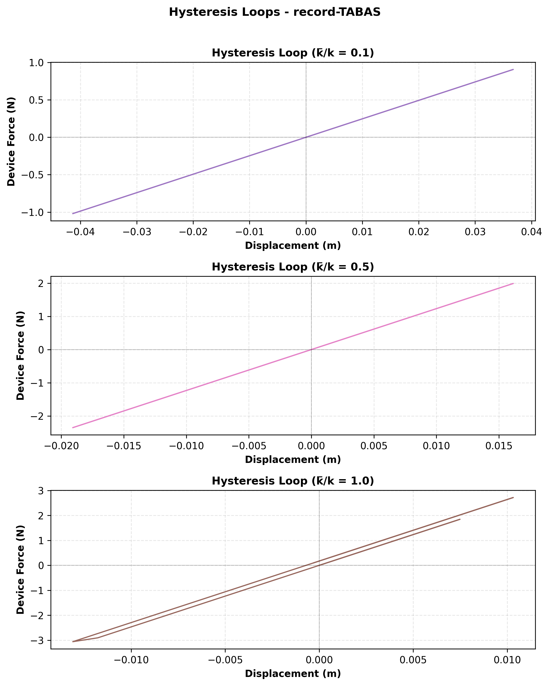

# SDOF system

An SDOF system is assumed:

* Stiffness $k$
* Unit mass $m=1$
* Natural period of the system $T$ is `0.4 sec`
* Viscous damping coefficient $c$
   * Viscous damping ratio $\zeta$ is `5%`

# Device

For seismic protection, an energy dissipating mechanism, i.e. supplemental device, is added to the system in parallel. The device has an elastic-perfectly-plastic behavior with the following hysteresis properties.


The device hysteresis behavior properties shown on the figure are:

* $\bar{k}$ is device stiffness
* $\bar{F}_y$ and $-\bar{F}_y$ are device yielding forces

# Seismic records

Two attached seismic acceleration time histories are considered. Their max value should be normalized to $0.4g$ before any computation.

# System alone

For SDOF sytesm without hysteresis mechanism and under the two seismic records, compute:

1. System response
   * Displacement and its max value
   * Base shear and its max value
      * Store the lowest of max values for two seismic time history as $F_{bs}$ variable
      * $F_{bs}$ value will be used later
1. System energy
   * Total input energy
   * Viscous damping energy
   * Elastic energy
   * Kinetic energy

# System with device

Add three separate devices with three hysteresis properties of:

* $\bar{k}=0.1k$
* $\bar{k}=0.5k$
* $\bar{k}=k$

Consider the $\bar{F}_y$ to be equal to $0.4 * F_{bs}$ for all of the three $\bar{k}$ cases above.

The system response and energy are needed for the system equipped with device:

1. System response
   * Displacement and its max value
   * Base shear and its max value
1. System energy
   * Total input energy
   * Viscous damping energy
   * Elastic energy
   * Kinetic energy
   * Hysteresis energy dissipated by device

# Implications

Evaluate the performance of the device by comparing:

* System alone
* System with device

# Charts

Minimal and concise functions are developed to draw charts. The required charts are:

* One chart with only one sub-plot
   * Comparing two scaled seismic records on top of each other
* For system without device, one chart with 2 sub-plots
   * One sub-plot for comparing energy components
      * Input energy
      * Kinetic energy
      * Viscous damping energy
      * Elastic energy
   * One sub-plot for checking energy balance
      * Input energy
      * Sum of kinetic, viscous damping, and elastic energies
* For each device case, one chart with 4 sub-plots in a 2x2 arrangement
   * One sub-plot for comparing displacement without and with device
   * One sub-plot for comparing base shear without and with device
   * One sub-plot for comparing energy components
      * Input energy
      * Kinetic energy
      * Viscous damping energy
      * Elastic energy
      * Hysteresis energy dissipated by device
   * One sub-plot for checking energy balance
      * Input energy
      * Sum of kinetic, viscous damping, elastic, and device hysteresis energies
* One chart with 3 sub-plots
   * Each sub-plot corresponds to the hysteresis loop of one of 3 device cases

# Simulation details

This is how the simulation will be done:

* There are two seismic record files; `record-ELCENTRO` and `record-TABAS`
   * Each of the two seismic records have 4 header lines
   * A record file has a header line like this: `NPTS=  1192, DT= .02000 SEC`
   * A record file has a header line like this: `NPTS=  4000, DT= .01000 SEC`
   * Seismic record files have to be read line-by-line
   * They can have a variable number of data on each line
* `OpenSeesPy` module is employed for structural analysis
   * A one-dimensional model is created by `OpenSeesPy`
   * Elastic-perfectly-plastic behavior of the hysteresis device will be modeled
   * Integrator is set to `integrator('Newmark', 0.5, 0.25)` for unconditional stability
   * Method `.reactions()` of `OpenSeesPy` is called before getting node reactions
*  Rayleigh damping is used
   * Mass-proportional satisfies the energy balance
      * `alpha_M = 2 * zeta * omega`
      * `beta_K = 0.0`
      * `ops.rayleigh(alpha_M, beta_K, 0.0, 0.0)`
   * Stiffness-proportional and classical Rayleigh (balanced) won't satisfy energy balance

# Code requirements

The code and the plotting functions are kept:

* Minimal
* Clear
* Clean
* Concise
* Readable
* Maintainable

# Energy computation

For an SDOF system with ground excitation and a hysteretic device in parallel:

$$m\ddot{u}(t) + c\dot{u}(t) + f_s(t) + f_h(t) = -m\ddot{u}_g(t)$$

Where:

* $u(t)$ = relative displacement (relative to ground)
* $\ddot{u}_g(t)$ = ground acceleration
* $f_s(t) = ku(t)$ = elastic restoring force
* $f_h(t)$ = hysteretic force from the device
* $m$ = mass, $c$ = damping coefficient, $k$ = elastic stiffness

## Energy Balance

Multiplying the equation of motion by $\dot{u}(t)$ and integrating from 0 to time $t$:

$$E_K(t) + E_D(t) + E_S(t) + E_H(t) = E_I(t)$$


## Kinetic Energy $E_K(t)$
The instantaneous kinetic energy:

$$E_K(t) = \frac{1}{2}m\dot{u}^2(t)$$

## Viscous Damping Energy $E_D(t)$
Cumulative energy dissipated by viscous damping:

$$E_D(t) = \int_0^t c\dot{u}^2(\tau) d\tau$$

For discrete time steps with interval $\Delta t$:

$$E_D^{i+1} = E_D^i + \frac{c}{2}(\dot{u}_i^2 + \dot{u}_{i+1}^2)\Delta t$$

## Elastic Strain Energy $E_S(t)$
Instantaneous elastic strain energy stored in the linear spring:

$$E_S(t) = \frac{1}{2}ku^2(t)$$

## Hysteretic Energy $E_H(t)$
Cumulative energy dissipated by the hysteretic device:

$$E_H(t) = \int_0^t f_h(\tau)\dot{u}(\tau) d\tau$$

For discrete time steps:

$$E_H^{i+1} = E_H^i + \frac{1}{2}(f_{h,i} + f_{h,i+1})(\Delta u_{i+1})$$

where $\Delta u_{i+1} = u_{i+1} - u_i$

## Input Energy $E_I(t)$
Total energy input from ground motion:

$$E_I(t) = -m\int_0^t \ddot{u}_g(\tau)\dot{u}(\tau) d\tau$$

For discrete time steps:

$$E_I^{i+1} = E_I^i - \frac{m}{2}(\ddot{u}_{g,i} + \ddot{u}_{g,i+1})(\Delta u_{i+1})$$

# Results

## Scaled records



## System without device: ELCENTRO



## System without device: TABAS



## System with device: ELCENTRO









## System with device: TABAS







# Implications

Quantitative performance of device:

* For record-ELCENTRO
   * Without device
      * Displacement max: `0.031014 m`
      * Base shear max: `7.65 N`
   * $\bar{k}=0.1k$
      * Displaecment change: `+1.70%`
      * Base shear change: `+11.87%`
   * $\bar{k}=0.5k$
      * Displacement change: `-23.32%`
      * Base shear change: `+15.02%`
   * $\bar{k}=1.0k$
      * Displacement change: `-48.86%`
      * Base shear change: `-8.86%`
* For record-TABAS
   * Without device
      * Displacement max: `0.043794 m`
      * Base shear max: `10.81 N`
   * $\bar{k}=0.1k$
      * Displacement change: `-5.57%`
      * Base shear change: `+3.87%`
   * $\bar{k}=0.5k$
      * Displacement change: `-56.43%`
      * Base shear change: `-34.65%`
   * $\bar{k}=1.0k$
      * Displacement change: `-70.07%`
      * Base shear change: `-41.74%`

# Code

```python
import os  # For directory creation

import matplotlib.pyplot as plt
import numpy as np
import openseespy.opensees as ops


class SeismicAnalysis:
    """SDOF system seismic analysis with optional hysteretic device"""

    def __init__(self):
        """Initialize system parameters"""
        self.m = 1.0  # Unit mass
        self.T = 0.4  # Natural period (sec)
        self.zeta = 0.05  # Damping ratio (5%)

        # Derived parameters
        self.omega = 2 * np.pi / self.T
        self.k = self.omega**2 * self.m
        self.c = 2 * self.zeta * self.omega * self.m

        # Storage for results
        self.Fbs = None  # Base shear threshold for device design

        # Create results directory if it doesn't exist
        self.results_dir = "results"
        if not os.path.exists(self.results_dir):
            os.makedirs(self.results_dir)

    def read_seismic_record(self, filename):
        """Read seismic record from file and normalize to 0.4g"""
        with open(filename, "r") as f:
            lines = f.readlines()

        # Parse header for NPTS and DT
        npts, dt = None, None
        for i in range(4):  # Check first 4 header lines
            if "NPTS=" in lines[i]:
                parts = lines[i].split(",")
                for part in parts:
                    if "NPTS=" in part:
                        npts = int(part.split("=")[1])
                    elif "DT=" in part:
                        dt = float(part.split("=")[1].replace("SEC", "").strip())
                break

        # Read acceleration data
        acc = []
        for line in lines[4:]:  # Skip 4 header lines
            values = line.strip().split()
            acc.extend([float(v) for v in values if v])

        acc = np.array(acc[:npts])

        # Normalize to 0.4g
        g = 9.81  # m/s²
        max_acc = np.max(np.abs(acc))
        acc = acc * (0.4 * g / max_acc)

        time = np.arange(len(acc)) * dt

        return time, acc, dt

    def analyze_system_alone(self, time, acc, dt):
        """Analyze SDOF system without device using OpenSeesPy"""
        ops.wipe()
        ops.model("basic", "-ndm", 1, "-ndf", 1)

        # Create nodes
        ops.node(1, 0.0)  # Fixed base
        ops.node(2, 0.0)  # Mass node

        # Boundary conditions
        ops.fix(1, 1)

        # Mass
        ops.mass(2, self.m)

        # Spring element
        ops.uniaxialMaterial("Elastic", 1, self.k)
        ops.element("zeroLength", 1, 1, 2, "-mat", 1, "-dir", 1)

        alpha_M = 2 * self.zeta * self.omega
        beta_K = 0.0

        # Damping
        ops.rayleigh(alpha_M, beta_K, 0.0, 0.0)

        # Time series for ground motion
        ops.timeSeries("Path", 1, "-dt", dt, "-values", *acc)
        ops.pattern("UniformExcitation", 1, 1, "-accel", 1)

        # Analysis settings
        ops.wipeAnalysis()
        ops.constraints("Plain")
        ops.numberer("Plain")
        ops.system("BandGeneral")
        ops.test("NormDispIncr", 1e-8, 10)
        ops.algorithm("Newton")
        ops.integrator("Newmark", 0.5, 0.25)
        ops.analysis("Transient")

        # Initialize arrays
        n_steps = len(time)
        disp = np.zeros(n_steps)
        vel = np.zeros(n_steps)
        base_shear = np.zeros(n_steps)

        # Run analysis
        for i in range(n_steps):
            ops.analyze(1, dt)
            disp[i] = ops.nodeDisp(2, 1)
            vel[i] = ops.nodeVel(2, 1)
            ops.reactions()
            base_shear[i] = -ops.nodeReaction(1, 1)

        # Calculate energies
        E_kinetic = 0.5 * self.m * vel**2
        E_elastic = 0.5 * self.k * disp**2

        E_damping = np.zeros(n_steps)
        E_input = np.zeros(n_steps)

        for i in range(1, n_steps):
            # Viscous damping energy (cumulative)
            E_damping[i] = (
                E_damping[i - 1] + 0.5 * self.c * (vel[i - 1] ** 2 + vel[i] ** 2) * dt
            )

            # Input energy (cumulative)
            du = disp[i] - disp[i - 1]
            E_input[i] = E_input[i - 1] - 0.5 * self.m * (acc[i - 1] + acc[i]) * du

        return {
            "time": time,
            "disp": disp,
            "base_shear": base_shear,
            "E_kinetic": E_kinetic,
            "E_elastic": E_elastic,
            "E_damping": E_damping,
            "E_input": E_input,
            "max_disp": np.max(np.abs(disp)),
            "max_base_shear": np.max(np.abs(base_shear)),
        }

    def analyze_with_device(self, time, acc, dt, k_bar_ratio, F_y_bar):
        """Analyze SDOF system with hysteretic device"""
        ops.wipe()
        ops.model("basic", "-ndm", 1, "-ndf", 1)

        # Create nodes
        ops.node(1, 0.0)  # Fixed base
        ops.node(2, 0.0)  # Mass node

        # Boundary conditions
        ops.fix(1, 1)

        # Mass
        ops.mass(2, self.m)

        # Main spring element
        ops.uniaxialMaterial("Elastic", 1, self.k)
        ops.element("zeroLength", 1, 1, 2, "-mat", 1, "-dir", 1)

        # Hysteretic device (elastic-perfectly-plastic)
        k_bar = k_bar_ratio * self.k
        eps_yP = F_y_bar / k_bar  # Yield strain
        ops.uniaxialMaterial("ElasticPP", 2, k_bar, eps_yP)
        ops.element("zeroLength", 2, 1, 2, "-mat", 2, "-dir", 1)

        alpha_M = 2 * self.zeta * self.omega
        beta_K = 0.0

        # Damping
        ops.rayleigh(alpha_M, beta_K, 0.0, 0.0)

        # Time series for ground motion
        ops.timeSeries("Path", 1, "-dt", dt, "-values", *acc)
        ops.pattern("UniformExcitation", 1, 1, "-accel", 1)

        # Analysis settings
        ops.wipeAnalysis()
        ops.constraints("Plain")
        ops.numberer("Plain")
        ops.system("BandGeneral")
        ops.test("NormDispIncr", 1e-8, 10)
        ops.algorithm("Newton")
        ops.integrator("Newmark", 0.5, 0.25)
        ops.analysis("Transient")

        # Initialize arrays
        n_steps = len(time)
        disp = np.zeros(n_steps)
        vel = np.zeros(n_steps)
        base_shear = np.zeros(n_steps)
        device_force = np.zeros(n_steps)

        # Run analysis
        for i in range(n_steps):
            ops.analyze(1, dt)
            disp[i] = ops.nodeDisp(2, 1)
            vel[i] = ops.nodeVel(2, 1)
            ops.reactions()
            base_shear[i] = -ops.nodeReaction(1, 1)
            device_force[i] = ops.eleForce(2, 2)  # Get from second node

        # Calculate energies
        E_kinetic = 0.5 * self.m * vel**2
        E_elastic = 0.5 * self.k * disp**2

        E_damping = np.zeros(n_steps)
        E_hysteresis = np.zeros(n_steps)
        E_input = np.zeros(n_steps)

        # Trapezoidal integration to maintain consistency with the Newmark integrator:
        for i in range(1, n_steps):
            # Viscous damping energy: ∫ c·u̇² dt
            # Trapezoidal rule: (dt/2) * [f(t_i-1) + f(t_i)]
            E_damping[i] = (
                E_damping[i - 1] + 0.5 * self.c * (vel[i - 1] ** 2 + vel[i] ** 2) * dt
            )

            # Hysteretic energy: ∫ fh·u̇ dt = ∫ fh·(du/dt) dt = ∫ fh·du
            # Trapezoidal approximation for fh over interval displacement
            du = disp[i] - disp[i - 1]
            E_hysteresis[i] = (
                E_hysteresis[i - 1] + 0.5 * (device_force[i - 1] + device_force[i]) * du
            )

            # Input energy: -∫ m·üg·u̇ dt = -∫ m·üg·(du/dt) dt = -∫ m·üg·du
            # Trapezoidal approximation for üg over interval displacement
            E_input[i] = E_input[i - 1] - 0.5 * self.m * (acc[i - 1] + acc[i]) * du

        return {
            "time": time,
            "disp": disp,
            "base_shear": base_shear,
            "device_force": device_force,
            "E_kinetic": E_kinetic,
            "E_elastic": E_elastic,
            "E_damping": E_damping,
            "E_hysteresis": E_hysteresis,
            "E_input": E_input,
            "max_disp": np.max(np.abs(disp)),
            "max_base_shear": np.max(np.abs(base_shear)),
        }

    def plot_seismic_records(self, records, filenames):
        """Plot normalized seismic records"""
        fig, ax = plt.subplots(figsize=(10, 5))

        colors = ["#1f77b4", "#ff7f0e"]
        for i, (rec, fname) in enumerate(zip(records, filenames)):
            ax.plot(
                rec["time"],
                rec["acc"],
                label=fname,
                color=colors[i],
                linewidth=1.2,
                alpha=0.8,
            )

        ax.set_xlabel("Time (s)", fontsize=11, fontweight="bold")
        ax.set_ylabel("Acceleration (m/s²)", fontsize=11, fontweight="bold")
        ax.set_title(
            "Normalized Seismic Records (0.4g)", fontsize=12, fontweight="bold", pad=15
        )
        ax.legend(fontsize=10, framealpha=0.9)
        ax.grid(True, alpha=0.3, linestyle="--")

        plt.tight_layout()
        filename = os.path.join(self.results_dir, "seismic_records.png")
        plt.savefig(filename, dpi=300, bbox_inches="tight")
        plt.show()

    def plot_system_alone(self, result, record_name):
        """Plot results for system without device"""
        fig, (ax1, ax2) = plt.subplots(2, 1, figsize=(10, 8))

        # Energy components
        ax1.plot(result["time"], result["E_input"], "k-", label="Input", linewidth=1.5)
        ax1.plot(
            result["time"],
            result["E_kinetic"],
            color="#1f77b4",
            label="Kinetic",
            linewidth=1.2,
        )
        ax1.plot(
            result["time"],
            result["E_damping"],
            color="#d62728",
            label="Damping",
            linewidth=1.2,
        )
        ax1.plot(
            result["time"],
            result["E_elastic"],
            color="#2ca02c",
            label="Elastic",
            linewidth=1.2,
        )
        ax1.set_xlabel("Time (s)", fontsize=10, fontweight="bold")
        ax1.set_ylabel("Energy (J)", fontsize=10, fontweight="bold")
        ax1.set_title(
            f"Energy Components - {record_name}", fontsize=11, fontweight="bold"
        )
        ax1.legend(fontsize=9, loc="best", framealpha=0.9)
        ax1.grid(True, alpha=0.3, linestyle="--")

        # Energy balance
        E_sum = result["E_kinetic"] + result["E_damping"] + result["E_elastic"]
        ax2.plot(result["time"], result["E_input"], "k-", label="Input", linewidth=1.5)
        ax2.plot(result["time"], E_sum, "r--", label="Sum", linewidth=1.5, alpha=0.8)
        ax2.set_xlabel("Time (s)", fontsize=10, fontweight="bold")
        ax2.set_ylabel("Energy (J)", fontsize=10, fontweight="bold")
        ax2.set_title(f"Energy Balance - {record_name}", fontsize=11, fontweight="bold")
        ax2.legend(fontsize=9, loc="best", framealpha=0.9)
        ax2.grid(True, alpha=0.3, linestyle="--")

        plt.tight_layout()
        filename = os.path.join(
            self.results_dir, f"system_alone_{record_name.replace('.txt', '')}.png"
        )
        plt.savefig(filename, dpi=300, bbox_inches="tight")
        plt.show()

    def plot_with_device(self, result_alone, result_device, k_bar_ratio, record_name):
        """Plot comparison for system with device"""
        fig = plt.figure(figsize=(12, 10))
        gs = fig.add_gridspec(2, 2, hspace=0.3, wspace=0.3)

        # Displacement comparison
        ax1 = fig.add_subplot(gs[0, 0])
        ax1.plot(
            result_alone["time"],
            result_alone["disp"],
            color="#1f77b4",
            label="Without Device",
            linewidth=1.2,
            alpha=0.7,
        )
        ax1.plot(
            result_device["time"],
            result_device["disp"],
            color="#d62728",
            label="With Device",
            linewidth=1.2,
        )

        # Mark max/min for displacement - WITHOUT DEVICE
        idx_max_alone = np.argmax(result_alone["disp"])
        idx_min_alone = np.argmin(result_alone["disp"])
        ax1.plot(
            result_alone["time"][idx_max_alone],
            result_alone["disp"][idx_max_alone],
            "o",
            color="#1f77b4",
            markersize=8,
            markeredgecolor="black",
            markeredgewidth=1.5,
            zorder=5,
        )
        ax1.plot(
            result_alone["time"][idx_min_alone],
            result_alone["disp"][idx_min_alone],
            "o",
            color="#1f77b4",
            markersize=8,
            markeredgecolor="black",
            markeredgewidth=1.5,
            zorder=5,
        )
        ax1.text(
            result_alone["time"][idx_max_alone],
            result_alone["disp"][idx_max_alone],
            f"  Max: {result_alone['disp'][idx_max_alone]:.4f}m",
            fontsize=8,
            verticalalignment="bottom",
            color="#1f77b4",
            fontweight="bold",
        )
        ax1.text(
            result_alone["time"][idx_min_alone],
            result_alone["disp"][idx_min_alone],
            f"  Min: {result_alone['disp'][idx_min_alone]:.4f}m",
            fontsize=8,
            verticalalignment="top",
            color="#1f77b4",
            fontweight="bold",
        )

        # Mark max/min for displacement - WITH DEVICE
        idx_max_dev = np.argmax(result_device["disp"])
        idx_min_dev = np.argmin(result_device["disp"])
        ax1.plot(
            result_device["time"][idx_max_dev],
            result_device["disp"][idx_max_dev],
            "s",
            color="#d62728",
            markersize=8,
            markeredgecolor="black",
            markeredgewidth=1.5,
            zorder=5,
        )
        ax1.plot(
            result_device["time"][idx_min_dev],
            result_device["disp"][idx_min_dev],
            "s",
            color="#d62728",
            markersize=8,
            markeredgecolor="black",
            markeredgewidth=1.5,
            zorder=5,
        )
        ax1.text(
            result_device["time"][idx_max_dev],
            result_device["disp"][idx_max_dev],
            f"  Max: {result_device['disp'][idx_max_dev]:.4f}m",
            fontsize=8,
            verticalalignment="bottom",
            color="#d62728",
            fontweight="bold",
        )
        ax1.text(
            result_device["time"][idx_min_dev],
            result_device["disp"][idx_min_dev],
            f"  Min: {result_device['disp'][idx_min_dev]:.4f}m",
            fontsize=8,
            verticalalignment="top",
            color="#d62728",
            fontweight="bold",
        )

        ax1.set_xlabel("Time (s)", fontsize=9, fontweight="bold")
        ax1.set_ylabel("Displacement (m)", fontsize=9, fontweight="bold")
        ax1.set_title(
            f"Displacement (k̄/k = {k_bar_ratio})", fontsize=10, fontweight="bold"
        )
        ax1.legend(fontsize=8, framealpha=0.9)
        ax1.grid(True, alpha=0.3, linestyle="--")

        # Base shear comparison
        ax2 = fig.add_subplot(gs[0, 1])
        ax2.plot(
            result_alone["time"],
            result_alone["base_shear"],
            color="#1f77b4",
            label="Without Device",
            linewidth=1.2,
            alpha=0.7,
        )
        ax2.plot(
            result_device["time"],
            result_device["base_shear"],
            color="#d62728",
            label="With Device",
            linewidth=1.2,
        )

        # Mark max/min for base shear - WITHOUT DEVICE
        idx_max_bs_alone = np.argmax(result_alone["base_shear"])
        idx_min_bs_alone = np.argmin(result_alone["base_shear"])
        ax2.plot(
            result_alone["time"][idx_max_bs_alone],
            result_alone["base_shear"][idx_max_bs_alone],
            "o",
            color="#1f77b4",
            markersize=8,
            markeredgecolor="black",
            markeredgewidth=1.5,
            zorder=5,
        )
        ax2.plot(
            result_alone["time"][idx_min_bs_alone],
            result_alone["base_shear"][idx_min_bs_alone],
            "o",
            color="#1f77b4",
            markersize=8,
            markeredgecolor="black",
            markeredgewidth=1.5,
            zorder=5,
        )
        ax2.text(
            result_alone["time"][idx_max_bs_alone],
            result_alone["base_shear"][idx_max_bs_alone],
            f"  Max: {result_alone['base_shear'][idx_max_bs_alone]:.2f}N",
            fontsize=8,
            verticalalignment="bottom",
            color="#1f77b4",
            fontweight="bold",
        )
        ax2.text(
            result_alone["time"][idx_min_bs_alone],
            result_alone["base_shear"][idx_min_bs_alone],
            f"  Min: {result_alone['base_shear'][idx_min_bs_alone]:.2f}N",
            fontsize=8,
            verticalalignment="top",
            color="#1f77b4",
            fontweight="bold",
        )

        # Mark max/min for base shear - WITH DEVICE
        idx_max_bs_dev = np.argmax(result_device["base_shear"])
        idx_min_bs_dev = np.argmin(result_device["base_shear"])
        ax2.plot(
            result_device["time"][idx_max_bs_dev],
            result_device["base_shear"][idx_max_bs_dev],
            "s",
            color="#d62728",
            markersize=8,
            markeredgecolor="black",
            markeredgewidth=1.5,
            zorder=5,
        )
        ax2.plot(
            result_device["time"][idx_min_bs_dev],
            result_device["base_shear"][idx_min_bs_dev],
            "s",
            color="#d62728",
            markersize=8,
            markeredgecolor="black",
            markeredgewidth=1.5,
            zorder=5,
        )
        ax2.text(
            result_device["time"][idx_max_bs_dev],
            result_device["base_shear"][idx_max_bs_dev],
            f"  Max: {result_device['base_shear'][idx_max_bs_dev]:.2f}N",
            fontsize=8,
            verticalalignment="bottom",
            color="#d62728",
            fontweight="bold",
        )
        ax2.text(
            result_device["time"][idx_min_bs_dev],
            result_device["base_shear"][idx_min_bs_dev],
            f"  Min: {result_device['base_shear'][idx_min_bs_dev]:.2f}N",
            fontsize=8,
            verticalalignment="top",
            color="#d62728",
            fontweight="bold",
        )

        ax2.set_xlabel("Time (s)", fontsize=9, fontweight="bold")
        ax2.set_ylabel("Base Shear (N)", fontsize=9, fontweight="bold")
        ax2.set_title(
            f"Base Shear (k̄/k = {k_bar_ratio})", fontsize=10, fontweight="bold"
        )
        ax2.legend(fontsize=8, framealpha=0.9)
        ax2.grid(True, alpha=0.3, linestyle="--")

        # Energy components with device
        ax3 = fig.add_subplot(gs[1, 0])
        ax3.plot(
            result_device["time"],
            result_device["E_input"],
            "k-",
            label="Input",
            linewidth=1.3,
        )
        ax3.plot(
            result_device["time"],
            result_device["E_kinetic"],
            color="#1f77b4",
            label="Kinetic",
            linewidth=1,
        )
        ax3.plot(
            result_device["time"],
            result_device["E_damping"],
            color="#d62728",
            label="Damping",
            linewidth=1,
        )
        ax3.plot(
            result_device["time"],
            result_device["E_elastic"],
            color="#2ca02c",
            label="Elastic",
            linewidth=1,
        )
        ax3.plot(
            result_device["time"],
            result_device["E_hysteresis"],
            color="#9467bd",
            label="Hysteresis",
            linewidth=1,
        )
        ax3.set_xlabel("Time (s)", fontsize=9, fontweight="bold")
        ax3.set_ylabel("Energy (J)", fontsize=9, fontweight="bold")
        ax3.set_title("Energy Components", fontsize=10, fontweight="bold")
        ax3.legend(fontsize=8, loc="best", framealpha=0.9, ncol=2)
        ax3.grid(True, alpha=0.3, linestyle="--")

        # Energy balance with device
        ax4 = fig.add_subplot(gs[1, 1])
        E_sum = (
            result_device["E_kinetic"]
            + result_device["E_damping"]
            + result_device["E_elastic"]
            + result_device["E_hysteresis"]
        )
        ax4.plot(
            result_device["time"],
            result_device["E_input"],
            "k-",
            label="Input",
            linewidth=1.3,
        )
        ax4.plot(
            result_device["time"], E_sum, "r--", label="Sum", linewidth=1.3, alpha=0.8
        )
        ax4.set_xlabel("Time (s)", fontsize=9, fontweight="bold")
        ax4.set_ylabel("Energy (J)", fontsize=9, fontweight="bold")
        ax4.set_title("Energy Balance", fontsize=10, fontweight="bold")
        ax4.legend(fontsize=8, framealpha=0.9)
        ax4.grid(True, alpha=0.3, linestyle="--")

        plt.suptitle(f"{record_name}", fontsize=11, fontweight="bold", y=0.995)

        filename = os.path.join(
            self.results_dir,
            f"with_device_{record_name.replace('.txt', '')}_k{k_bar_ratio}.png",
        )
        plt.savefig(filename, dpi=300, bbox_inches="tight")
        plt.show()

    def plot_hysteresis_loops(self, device_results, record_name):
        """Plot hysteresis loops for all device cases"""
        fig, axes = plt.subplots(3, 1, figsize=(8, 10))
        ratios = [0.1, 0.5, 1.0]
        colors = ["#9467bd", "#e377c2", "#8c564b"]

        for i, r in enumerate(ratios):
            res = device_results[r]
            axes[i].plot(
                res["disp"],
                res["device_force"],
                color=colors[i],
                linewidth=1.2,
                alpha=0.9,
            )
            axes[i].set_xlabel("Displacement (m)", fontsize=10, fontweight="bold")
            axes[i].set_ylabel("Device Force (N)", fontsize=10, fontweight="bold")
            axes[i].set_title(
                f"Hysteresis Loop (k̄/k = {r})", fontsize=11, fontweight="bold"
            )
            axes[i].grid(True, alpha=0.3, linestyle="--")
            axes[i].axhline(y=0, color="k", linewidth=0.5, linestyle="-", alpha=0.3)
            axes[i].axvline(x=0, color="k", linewidth=0.5, linestyle="-", alpha=0.3)

        plt.suptitle(
            f"Hysteresis Loops - {record_name}", fontsize=12, fontweight="bold"
        )
        plt.tight_layout(rect=[0, 0, 1, 0.97])

        filename = os.path.join(
            self.results_dir, f"hysteresis_loops_{record_name.replace('.txt', '')}.png"
        )
        plt.savefig(filename, dpi=300, bbox_inches="tight")
        plt.show()


# === Execution Example ===
if __name__ == "__main__":
    sa = SeismicAnalysis()

    # Seismic record filenames
    filenames = ["record-TABAS", "record-ELCENTRO"]

    # Load records
    t1, acc1, dt1 = sa.read_seismic_record(filenames[0])
    t2, acc2, dt2 = sa.read_seismic_record(filenames[1])

    # Plot seismic records
    sa.plot_seismic_records(
        [{"time": t1, "acc": acc1}, {"time": t2, "acc": acc2}], filenames
    )

    # Analyze system alone for both records
    res1 = sa.analyze_system_alone(t1, acc1, dt1)
    res2 = sa.analyze_system_alone(t2, acc2, dt2)
    sa.plot_system_alone(res1, filenames[0])
    sa.plot_system_alone(res2, filenames[1])

    # Determine F̄_y = 0.4 * F_bs (lowest max base shear)
    sa.Fbs = min(res1["max_base_shear"], res2["max_base_shear"])
    F_y_bar = 0.4 * sa.Fbs

    # Device stiffness ratios
    k_ratios = [0.1, 0.5, 1.0]

    # Analysis for record
    device_results_1 = {}
    for r in k_ratios:
        res_dev = sa.analyze_with_device(t1, acc1, dt1, r, F_y_bar)
        device_results_1[r] = res_dev
        sa.plot_with_device(res1, res_dev, r, filenames[0])
    sa.plot_hysteresis_loops(device_results_1, filenames[0])

    # Analysis for record
    device_results_2 = {}
    for r in k_ratios:
        res_dev = sa.analyze_with_device(t2, acc2, dt2, r, F_y_bar)
        device_results_2[r] = res_dev
        sa.plot_with_device(res2, res_dev, r, filenames[1])
    sa.plot_hysteresis_loops(device_results_2, filenames[1])

```
