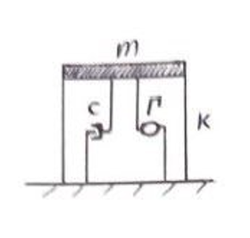
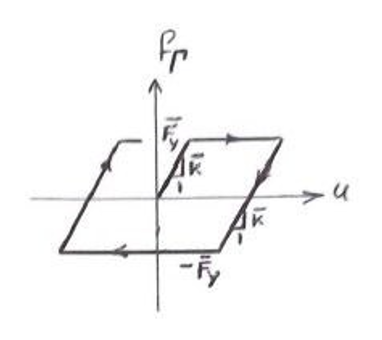

An SDOF system is assumed:

* Stiffness $k$
* Unit mass $m=1$
* Damping coefficient $c$
   * Damping ratio $\zeta$ is `5%`
* Natural period of the system $T$ is `0.4 sec`

For seismic protection, an energy dissipating mechanism, i.e. damper, is added to the system with the attached hysteresis properties.

The damper hysteresis properties shown on the attached figure are:

* $\bar{k}$ is damper stiffness
* $\bar{F}_y$ is dampler yielding force

# System alone

For SDOF sytesm without hysteresis mechanism and under the two attached seismic time histories, I need:

1. System response
   * Displacement and its max value
   * Base shear and its max value
      * Store the lowest of max values for two seismic time history as $F_{bs}$ variable
      * $F_{bs}$ value will be used later
1. System energy
   * Total input energy
   * Damping energy
   * Elastic energy
   * Inertial energy
   * Chart comparison of energies, maybe by cumulative sum

# System with damper

Add three separate dampers with three hysteresis properties of:

* $\bar{k}=0.1$
* $\bar{k}=0.5k$
* $\bar{k}=k$

Consider the $\bar{F}_y$ to be equal to $0.4 * F_{bs}$ for all of the three $\bar{k}$ cases above.

The system response and energy are needed for the system equipped with damper:

1. System response
   * Displacement and its max value
   * Base shear and its max value
1. System energy
   * Total input energy
   * Damping energy
   * Elastic energy
   * Inertial energy
   * Chart comparison of energies, maybe by cumulative sum

# Implications

Evaluate the performance of the damper by comparing:

* System alone
* System with damper
