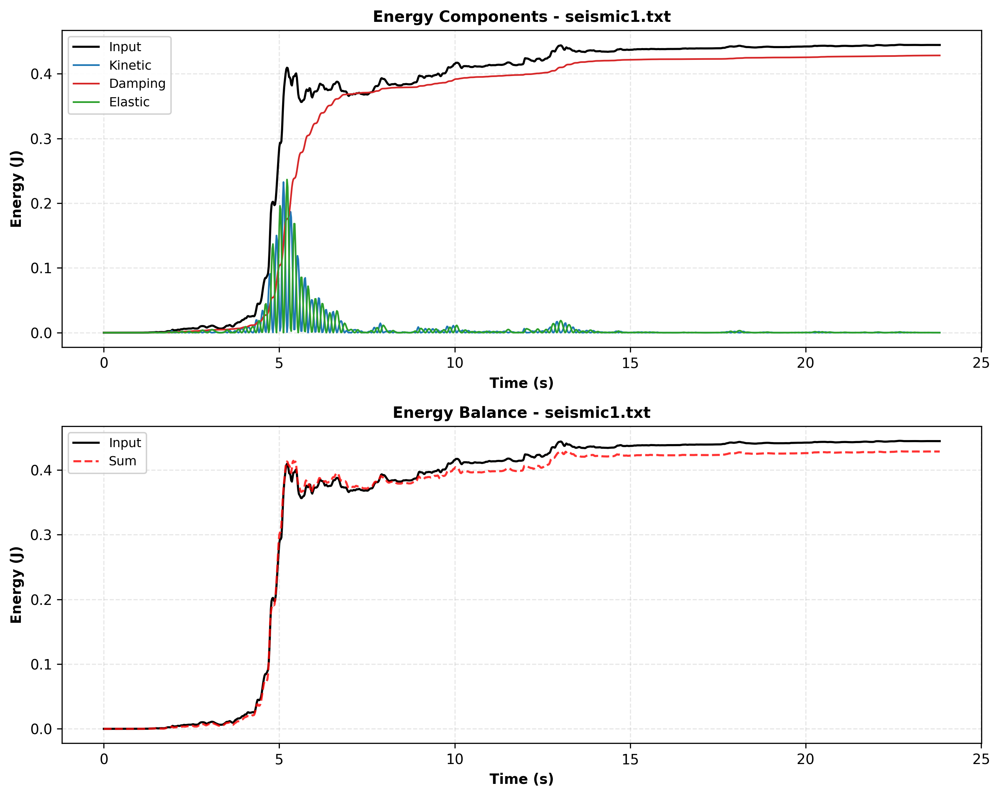
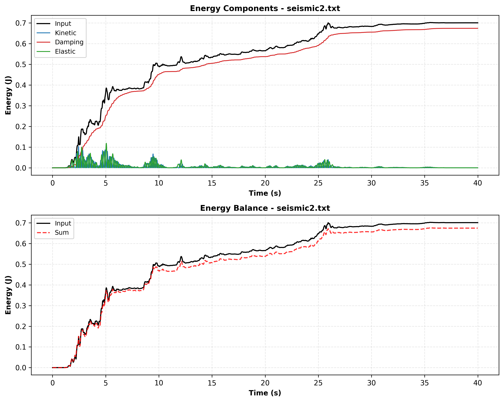
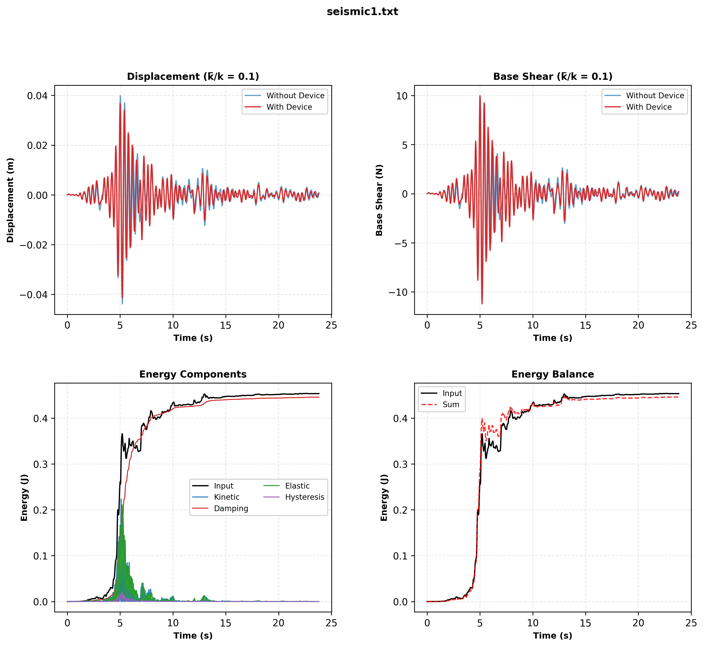
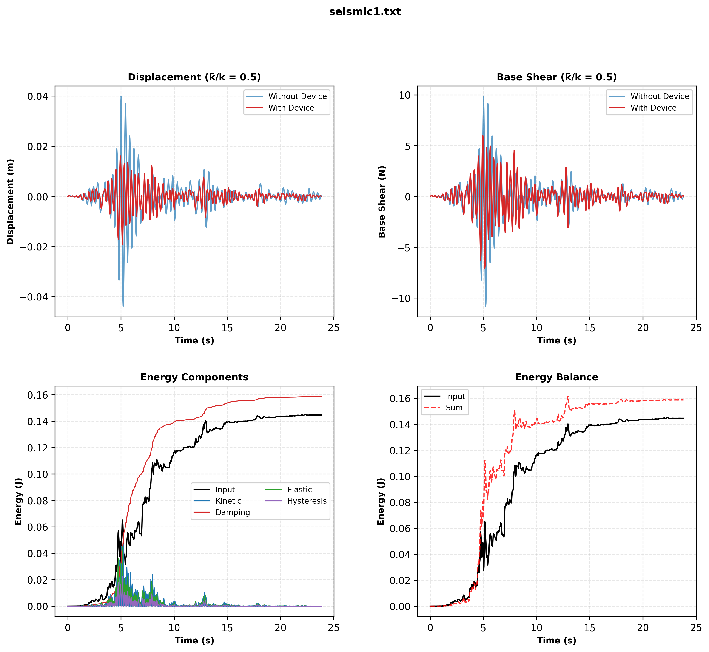
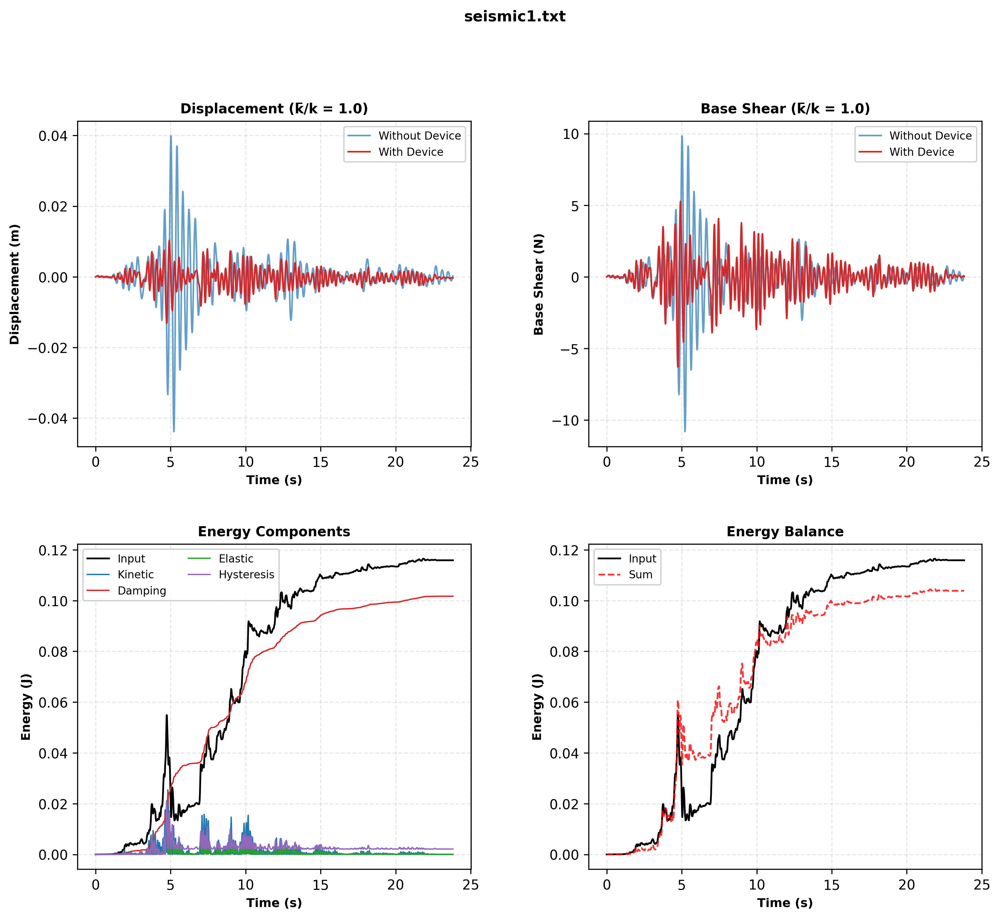
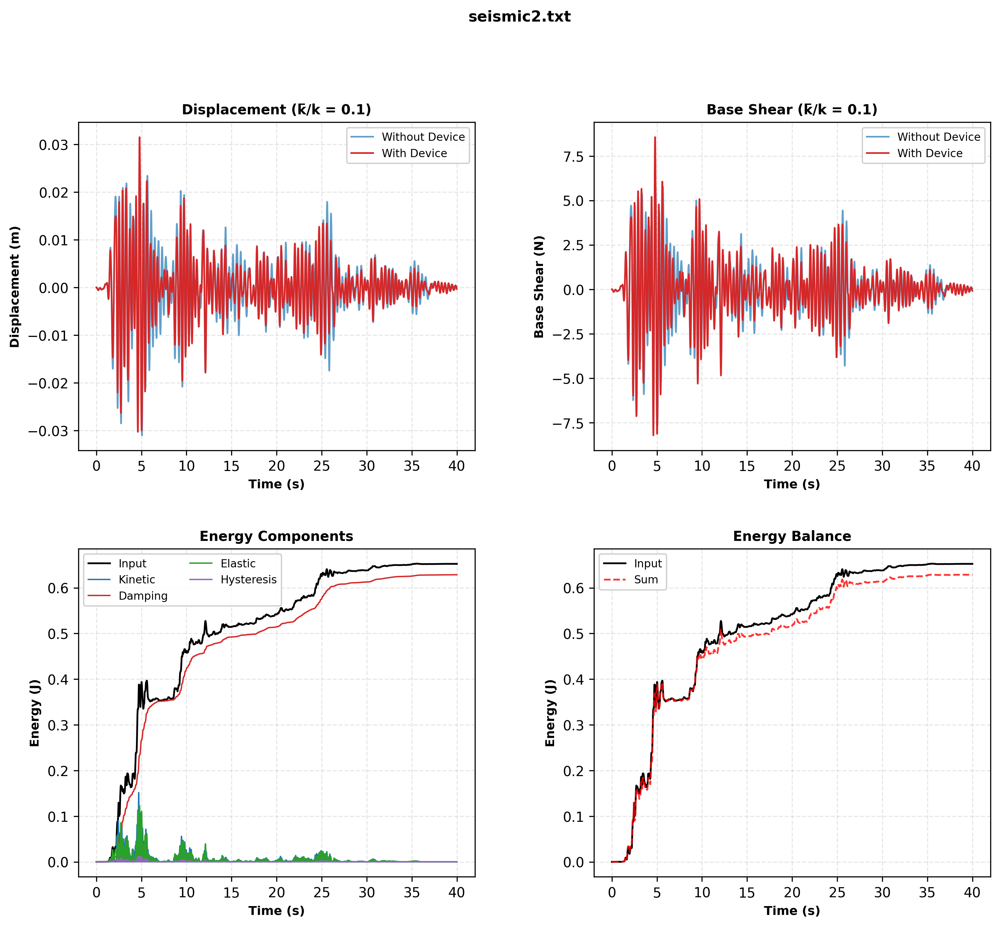
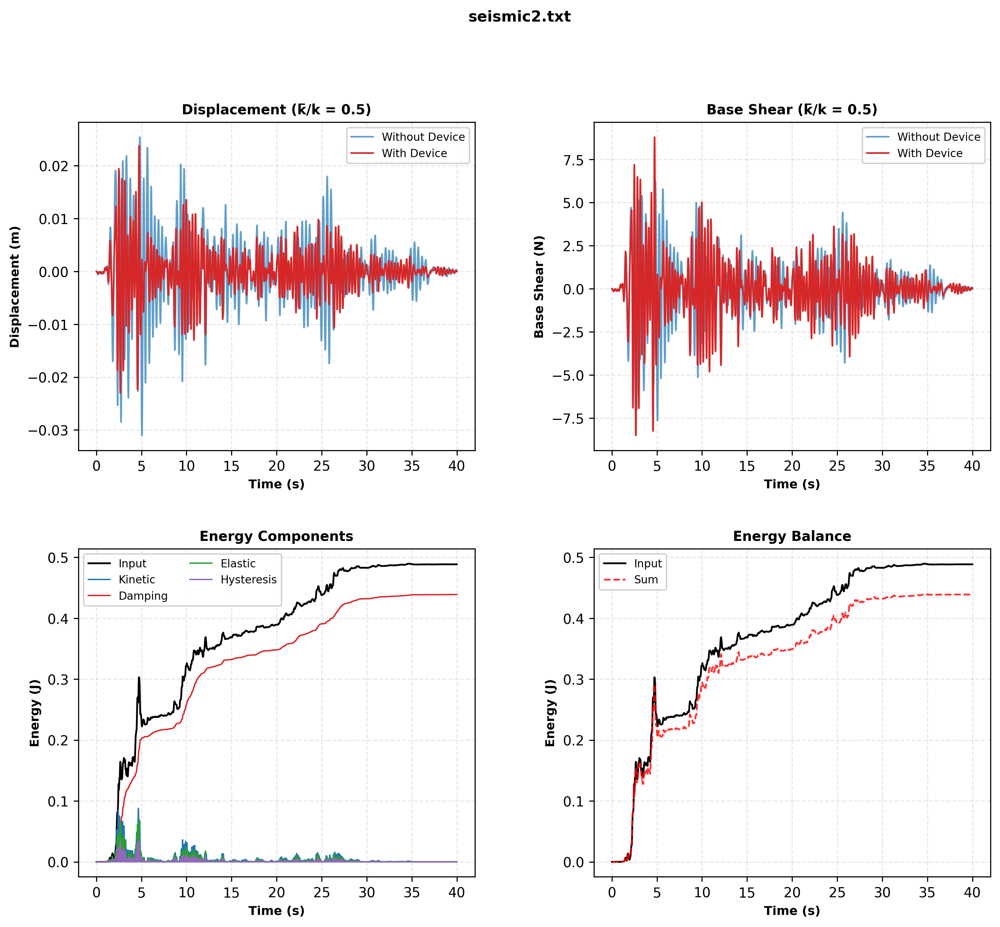
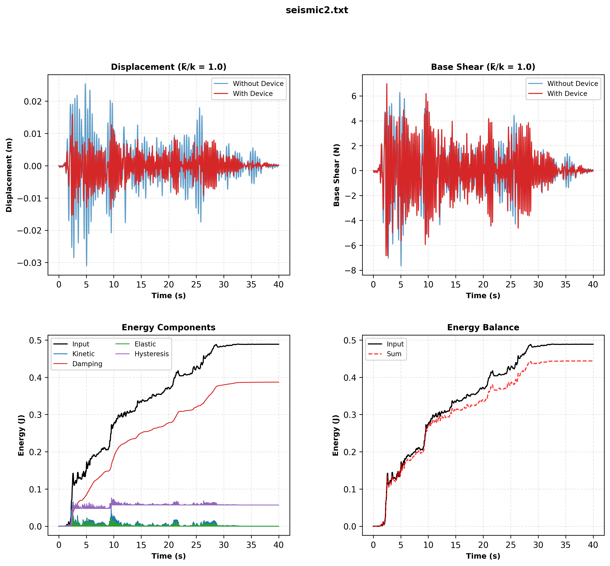
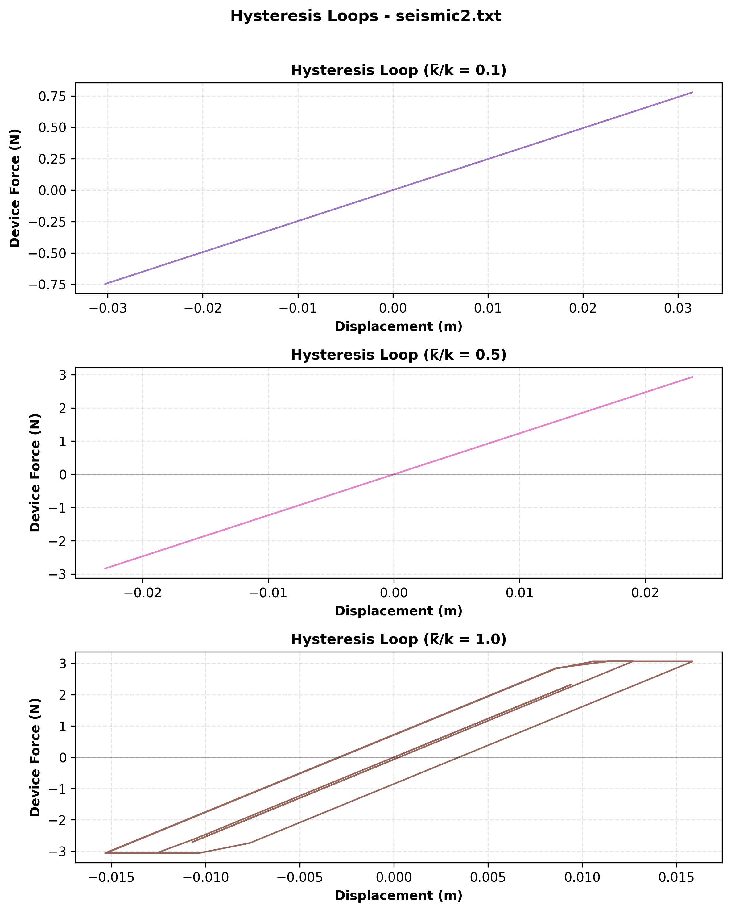

# SDOF system

An SDOF system is assumed:

* Stiffness $k$
* Unit mass $m=1$
* Natural period of the system $T$ is `0.4 sec`
* Viscous damping coefficient $c$
   * Viscous damping ratio $\zeta$ is `5%`

# Device

For seismic protection, an energy dissipating mechanism, i.e. supplemental device, is added to the system in parallel. The device has an elastic-perfectly-plastic behavior with the following hysteresis properties.

The device hysteresis behavior properties shown on the figure are:

* $\bar{k}$ is device stiffness
* $\bar{F}_y$ and $-\bar{F}_y$ are device yielding forces

# Seismic records

Two attached seismic acceleration time histories are considered. Their max value should be normalized to $0.4g$ before any computation.

# System alone

For SDOF sytesm without hysteresis mechanism and under the two seismic records, compute:

1. System response
   * Displacement and its max value
   * Base shear and its max value
      * Store the lowest of max values for two seismic time history as $F_{bs}$ variable
      * $F_{bs}$ value will be used later
1. System energy
   * Total input energy
   * Viscous damping energy
   * Elastic energy
   * Kinetic energy

# System with device

Add three separate devices with three hysteresis properties of:

* $\bar{k}=0.1k$
* $\bar{k}=0.5k$
* $\bar{k}=k$

Consider the $\bar{F}_y$ to be equal to $0.4 * F_{bs}$ for all of the three $\bar{k}$ cases above.

The system response and energy are needed for the system equipped with device:

1. System response
   * Displacement and its max value
   * Base shear and its max value
1. System energy
   * Total input energy
   * Viscous damping energy
   * Elastic energy
   * Kinetic energy
   * Hysteresis energy dissipated by device

# Implications

Evaluate the performance of the device by comparing:

* System alone
* System with device

# Charts

Minimal and concise functions are developed to draw charts. The required charts are:

* One chart with only one sub-plot
   * Comparing two scaled seismic records on top of each other
* For system without device, one chart with 2 sub-plots
   * One sub-plot for comparing energy components
      * Input energy
      * Kinetic energy
      * Viscous damping energy
      * Elastic energy
   * One sub-plot for checking energy balance
      * Input energy
      * Sum of kinetic, viscous damping, and elastic energies
* For each device case, one chart with 4 sub-plots in a 2x2 arrangement
   * One sub-plot for comparing displacement without and with device
   * One sub-plot for comparing base shear without and with device
   * One sub-plot for comparing energy components
      * Input energy
      * Kinetic energy
      * Viscous damping energy
      * Elastic energy
      * Hysteresis energy dissipated by device
   * One sub-plot for checking energy balance
      * Input energy
      * Sum of kinetic, viscous damping, elastic, and device hysteresis energies
* One chart with 3 sub-plots
   * Each sub-plot corresponds to the hysteresis loop of one of 3 device cases

# Simulation details

This is how the simulation will be done:

* Two seismic record file names are `seismic1.txt` and `seismic2.txt`
   * Each of the two seismic records have 4 header lines
   * 1st seismic record file has a header line like this: `NPTS=  1192, DT= .02000 SEC`
   * 2nd seismic record file has a header line like this: `NPTS=  4000, DT= .01000 SEC`
   * Seismic record files have to be read line-by-line
   * They can have a variable number of data on each line
* `OpenSeesPy` module is employed for structural analysis
   * A one-dimensional model is created by `OpenSeesPy`
   * Elastic-perfectly-plastic behavior of the hysteresis device will be modeled
   * Integrator is set to `integrator('Newmark', 0.5, 0.25)` for unconditional stability
   * Method `.reactions()` of `OpenSeesPy` is called before getting node reactions
*  Rayleigh damping is used
   * Mass-proportional satisfies the energy balance
      * `alpha_M = 2 * zeta * omega`
      * `beta_K = 0.0`
      * `ops.rayleigh(alpha_M, beta_K, 0.0, 0.0)`
   * Stiffness-proportional and classical Rayleigh (balanced) won't satisfy energy balance

# Code requirements

The code and the plotting functions are kept:

* Minimal
* Clear
* Clean
* Concise
* Readable
* Maintainable

# Energy calculation

For an SDOF system with ground excitation and a hysteretic device in parallel:

$$m\ddot{u}(t) + c\dot{u}(t) + f_s(t) + f_h(t) = -m\ddot{u}_g(t)$$

Where:

* $u(t)$ = relative displacement (relative to ground)
* $\ddot{u}_g(t)$ = ground acceleration
* $f_s(t) = ku(t)$ = elastic restoring force
* $f_h(t)$ = hysteretic force from the device
* $m$ = mass, $c$ = damping coefficient, $k$ = elastic stiffness

## Energy Balance

Multiplying the equation of motion by $\dot{u}(t)$ and integrating from 0 to time $t$:

$$E_K(t) + E_D(t) + E_S(t) + E_H(t) = E_I(t)$$

## Kinetic Energy $E_K(t)$
The instantaneous kinetic energy:

$$E_K(t) = \frac{1}{2}m\dot{u}^2(t)$$

## Viscous Damping Energy $E_D(t)$
Cumulative energy dissipated by viscous damping:

$$E_D(t) = \int_0^t c\dot{u}^2(\tau) d\tau$$

For discrete time steps with interval $\Delta t$:

$$E_D^{i+1} = E_D^i + \frac{c}{2}(\dot{u}_i^2 + \dot{u}_{i+1}^2)\Delta t$$

## Elastic Strain Energy $E_S(t)$
Instantaneous elastic strain energy stored in the linear spring:

$$E_S(t) = \frac{1}{2}ku^2(t)$$

## Hysteretic Energy $E_H(t)$
Cumulative energy dissipated by the hysteretic device:

$$E_H(t) = \int_0^t f_h(\tau)\dot{u}(\tau) d\tau$$

For discrete time steps:

$$E_H^{i+1} = E_H^i + \frac{1}{2}(f_{h,i} + f_{h,i+1})(\Delta u_{i+1})$$

where $\Delta u_{i+1} = u_{i+1} - u_i$

## Input Energy $E_I(t)$
Total energy input from ground motion:

$$E_I(t) = -m\int_0^t \ddot{u}_g(\tau)\dot{u}(\tau) d\tau$$

For discrete time steps:

$$E_I^{i+1} = E_I^i - \frac{m}{2}(\ddot{u}_{g,i} + \ddot{u}_{g,i+1})(\Delta u_{i+1})$$

# Results

## Scaled records

## System without device: TABAS: `seismic1.txt`

## System without device: EL CENTRO: `seismic2.txt`

## System with device: TABAS: `seismic1.txt`

## System with device: EL CENTRO: `seismic2.txt`

